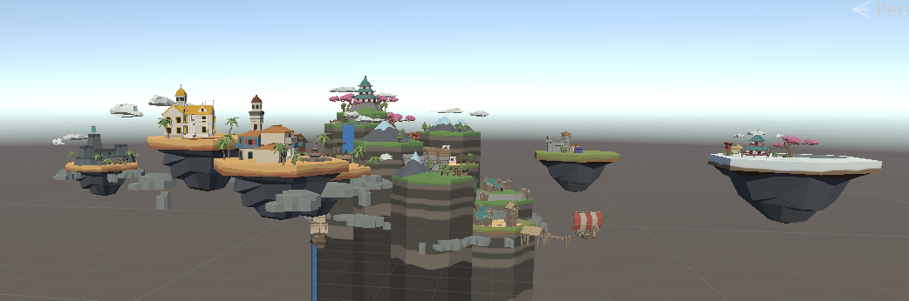

## CSE Capstone Team 4 Project (4 Fun) 
[Project Code](https://github.com/cse-vr-capstone-team-4/UnityProject) |
[Website and Blog](https://cse-vr-capstone-team-4.github.io/Island-Warfare/) |
[Unity Code](https://github.com/cse-vr-capstone-team-4/UnityProject) |
[Product Requirement Documents](https://docs.google.com/document/d/1tK8rWAsgP0X3kz5zsiT1drsX3x8JszOWKTgnmHstGJ0/edit?usp=sharing) |
[Demo](#Todo)

### Description of project: Island Warfare

Our project is an Magic Leap AR "Island Colonization" video game where the player attempts to take over floating islands by defeating enemies. The player can switch between a high-level overview of the world where they distribute units to different floating islands and a low-level view where they actually walk onto the island and watch the battle themselves.

### Team members
- **Anny Kong**
- **Charles Mihran**
- **Xiuxing Lao**
- **Yuyang Ge**
